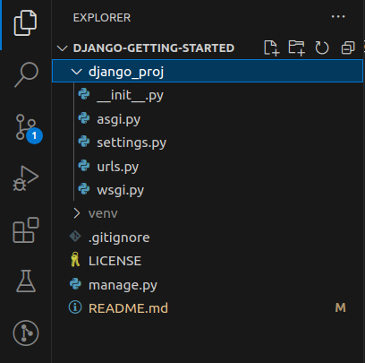
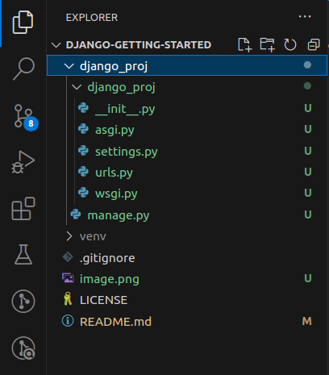

# Getting Started with Django on Linux

A guide for getting started with Django by creating a Django project, a Django app, making the initial migration, and running the Django development server.

## 1. Getting Started

### A. Resources

For a more comprehensive guide to working with [Django](https://www.djangoproject.com/), check out the official [Django documentation](https://docs.djangoproject.com/en/5.0/).

### B. Requirements

For the purposes of this guide, you will need:

- A [Linux](https://www.linux.org/pages/download/) operating system.
- [Python](https://www.python.org/) version 3 or higher installed in your system.
- A [code editor](https://www.codecademy.com/resources/blog/popular-ides-and-code-editors/) e.g. [VSCode](https://code.visualstudio.com/).

## 2. Initializing

Before you can install Django and create a Django project or app, you will need to set up a **virtual environment**.

### A. Virtual Environment

Think of a **virtual environment** as a container to store all the packages/libraries that you will use in your Django project.

- This sets aside your project's packages from those already installed globally in your system.
- It also helps you avoid overloading your project with the other installed packages, which you may not need/want to use in the project.

Learn more about a **Python virtual environment** in the official [Python documentation](https://docs.python.org/3/library/venv.html).

#### i. Create a virtual environment

In your code editor's workspace, take the following steps to create a virtual environment:

- Open your terminal and run the following command:

  ```
  virtualenv venv
  ```

  

- Let's break down the command:
  - `virtualenv` is the section of the command that triggers the creation of the virtual environment.
  - `venv` is the (conventional) name of your virtual environment. You may name it anything relevant like `env` or whatever you'll prefer.
- If you're following this guide step-by-step, you will notice a new folder titled `venv` created in the root directory of your workspace.

  

#### ii. Activate your virtual environment

After creating a virtual environment, you need to activate it before you can use it to store libraries/packages that you will install.

- Run the following command to activate your virtual environment:
  ```
  source venv/bin/activate
  ```
- You may replace `venv` with the name you used when creating your virtual environment.

### B. `.gitignore`

Before you can proceed with installing Django, you need to do one more thing: put the `.gitignore` file to use.

A gitignore file stores all folders and files that you do not want to be pushed to your remote GitHub repository.

You should keep the size of your remote repository as light as possible, and push only what is necessary to it.

You should also keep sensitive information/data in your local system and not expose them to the public by pushing them to GitHub. A `.gitignore` file comes handy in this case as well.

You will add your virtual environment to `.gitignore`. Later on, you will learn how to retrieve the packages/libraries stored in your virtual environment so that you can still access these `dependencies` even when you don't have access to the virtual environment that you created earlier on.

#### i. Create a `.gitignore` file

If you don't have a `.gitignore` file already, you will need to create one in the root directory of your workspace. Follow these steps:

- Open your workspace's file explorer.
- Manually create the `.gitignore` file in the root directory of your workspace.

  

- An alternative approach is to add a `.gitignore` file when creating your new GitHub repository:

  

#### ii. Add your virtual environment folder to `.gitignore`

Now, add your virtual environment folder to `.gitignore`. Follow these steps:

- Open your `.gitignore` file.
- In a new line, type or paste the following:
  ```
  venv/
  ```
- You may replace `venv` with the name you used when creating your virtual environment.
- This will inform your source control that you do not want to push your virtual environment folder, `venv`, including all its contents `/`
- The following `.gitignore` file was generated by GitHub when I was creating this project's repository.

  

## 3. Setting Up Django

You are now ready to start installing packages/libraries for your project. The very first package will be `django`.

Learn more about Django in the official [Django documentation](https://docs.djangoproject.com/).

### A. Install Django

Take the steps below to install `django` in your virtual environmet.

- Run the following command:
  ```
  pip install django
  ```
- What does this command do?

  - It installs the latest, stable version of the `django` package, along with other libraries that `django` depends on to run.

    

### B. A Django Project

A Django Project contains the core settings and configurations that all Django **Apps** you will build will rely and run on. Think of it as a container for any/all Django application(s) you will create. But it is more than a "container".

Learn more in the official [Django Documentation](https://docs.djangoproject.com/).

#### i. Create a Django project

Take the step below to create a Django project.

- Run the following command:
  ```
  django-admin startproject django_proj .
  ```
- You may replace `django_proj` with your preferred name for your project.
- Let's break down this command:

  - `django-admin` is the section of the command that triggers the creation of either a **Django project** or a **Django app**.
  - `startproject` is the section of the command that tells Django specifically what we want to create between the **project** and the **application**.
  - `django_proj` is the name I chose for the project. You may call it anything relevant to what you're building.
  - The period `.` I added at the end tells Django to create the project within the current folder (which in this case is the root folder of my workspace)

    

  - Without the period `.`, Django will create the project within a containing folder of the same name.

    

  - Either approach is okay, depending on how you want to manage your workspace.

- What happens after the command?

  - Django creates a folder containing files which all our applications will rely and run on.

    

  - The files you will mostly interract with are:
    - `settings.py`: contains the project's configurations, which will be applied to any/all application(s) installed/created.
    - `urls.py`: contains the url configurations that connect an application to the project. This is one of the ways that the project communicates with each application connected to it. In the context of APIs, this file defines base URLs which all other URL endpoints will connect to.
