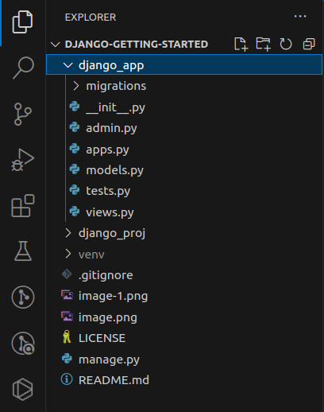

# Getting Started with Django on Linux

A guide for getting started with Django by creating a Django project, a Django app, making the initial migration, and running the Django development server.

## 1. Getting Started

### A. Resources

For a more comprehensive guide to working with [Django](https://www.djangoproject.com/), check out the official [Django documentation](https://docs.djangoproject.com/en/5.0/).

### B. Requirements

For the purposes of this guide, you will need:

- A [Linux](https://www.linux.org/pages/download/) operating system.
- [Python](https://www.python.org/) version 3 or higher installed in your system.
- A [code editor](https://www.codecademy.com/resources/blog/popular-ides-and-code-editors/) e.g. [VSCode](https://code.visualstudio.com/).

## 2. Initializing

Before you can install Django and create a Django project or app, you will need to set up a **virtual environment**.

### A. Virtual Environment

Think of a **virtual environment** as a container to store all the packages/libraries that you will use in your Django project.

- This sets aside your project's packages from those already installed globally in your system.
- It also helps you avoid overloading your project with the other installed packages, which you may not need/want to use in the project.

Learn more about a **Python virtual environment** in the official [Python documentation](https://docs.python.org/3/library/venv.html).

#### i. Create a virtual environment

In your code editor's workspace, take the following steps to create a virtual environment:

- Open your terminal and run the following command:

  ```
  virtualenv venv
  ```

  

- Let's break down the command:
  - `virtualenv` is the section of the command that triggers the creation of the virtual environment.
  - `venv` is the (conventional) name of your virtual environment. You may name it anything relevant like `env` or whatever you'll prefer.
- If you're following this guide step-by-step, you will notice a new folder titled `venv` created in the root directory of your workspace.

  

#### ii. Activate your virtual environment

After creating a virtual environment, you need to activate it before you can use it to store libraries/packages that you will install.

- Run the following command to activate your virtual environment:
  ```
  source venv/bin/activate
  ```
- You may replace `venv` with the name you used when creating your virtual environment.

### B. `.gitignore`

Before you can proceed with installing Django, you need to do one more thing: put the `.gitignore` file to use.

A gitignore file stores all folders and files that you do not want to be pushed to your remote GitHub repository.

You should keep the size of your remote repository as light as possible, and push only what is necessary to it.

You should also keep sensitive information/data in your local system and not expose them to the public by pushing them to GitHub. A `.gitignore` file comes handy in this case as well.

You will add your virtual environment to `.gitignore`. Later on, you will learn how to retrieve the packages/libraries stored in your virtual environment so that you can still access these `dependencies` even when you don't have access to the virtual environment that you created earlier on.

#### i. Create a `.gitignore` file

If you don't have a `.gitignore` file already, you will need to create one in the root directory of your workspace. Follow these steps:

- Open your workspace's file explorer.
- Manually create the `.gitignore` file in the root directory of your workspace.

  

- An alternative approach is to add a `.gitignore` file when creating your new GitHub repository:

  

#### ii. Add your virtual environment folder to `.gitignore`

Now, add your virtual environment folder to `.gitignore`. Follow these steps:

- Open your `.gitignore` file.
- In a new line, type or paste the following:
  ```
  venv/
  ```
- You may replace `venv` with the name you used when creating your virtual environment.
- This will inform your source control that you do not want to push your virtual environment folder, `venv`, including all its contents `/`
- The following `.gitignore` file was generated by GitHub when I was creating this project's repository.

  

## 3. Setting Up Django

You are now ready to start installing packages/libraries for your project. The very first package will be `django`.

Learn more about Django in the official [Django documentation](https://docs.djangoproject.com/).

### A. Install Django

Take the steps below to install `django` in your virtual environmet.

- Run the following command:
  ```
  pip install django
  ```
- What does this command do?

  - It installs the latest, stable version of the `django` package, along with other libraries that `django` depends on to run.

    

### B. `.env`

An environment file, `.env`, is the home for all sensitive information/data within your workspace.

I recommend that you do not expose or make publicly available, any sensitive information, including but not limited to:

- Credentials (e.g. username and/or password).
- Tokens (e.g. access token).
- Security/Secret keys
- Hosts of your project

The contents of a `.env` file are referred to as **environment variables**.

#### i. Create a `.env` file

In the root directory of your workspace, follow the step below:

- Manually create a `.env` file
- Add the following **environment variable**:
  ```
  MODE='dev'
  ```
- The variable above determines whether your project is in `development` or `production` mode.
- Whenever you're working locally, remember to set this variable's value to `dev`. You will learn later on more ways that you can use this variable.

You will also use the `.env` file more extensively later on.

### C. A Django Project

A Django Project contains the core settings and configurations that all Django **Apps** you will build will rely and run on. Think of it as a container for any/all Django application(s) you will create. But it is more than a "container".

Learn more in the official [Django Documentation](https://docs.djangoproject.com/).

#### i. Create a Django project

**Important:** If you've been committing and pushing your changes to GitHub, please **do not** commit and push any changes after creating your Django project yet.

Take the step below to create a Django project.

- Run the following command:
  ```
  django-admin startproject django_proj .
  ```
- You may replace `django_proj` with your preferred name for your project.
- Let's break down this command:

  - `django-admin` is the section of the command that triggers the creation of either a **Django project** or a **Django app**.
  - `startproject` is the section of the command that tells Django specifically what we want to create between the **project** and the **application**.
  - `django_proj` is the name I chose for the project. You may call it anything relevant to what you're building.
  - The period `.` I added at the end tells Django to create the project within the current folder (which in this case is the root folder of my workspace)

    

  - Without the period `.`, Django will create the project within a containing folder of the same name.

    

  - Either approach is okay, depending on how you want to manage your workspace.

- What happens after the command?

  - Django creates a folder containing files which all our applications will rely and run on.

    

  - The files you will mostly interract with are:
    - `settings.py`: contains the project's configurations, which will be applied to any/all application(s) installed/created.
    - `urls.py`: contains the url configurations that connect an application to the project. This is one of the ways that the project communicates with each application connected to it. In the context of APIs, this file defines base URLs which all other URL endpoints will connect to.

**Remember:** Do not commit and push any changes to GitHub yet. Check out **(ii)**, **(iii)**, and **(iv)** below for more information.

#### ii. Install `python-decouple`

After storing any sensitive information in the environment file `.env`, you will need a way to retrieve this information. The `python-decouple` package/library enables you to do this seamlessly.

- Run the following command to install python-decouple:

  ```
  pip install python-decouple
  ```

#### iii. Import `config`

The package/library `python-decouple` that you installed in **(ii)** above exposes a variable called `config`, which you can use to retrieve **environment variables**.

Follow these steps to import `config` in your Django project:

- Open your project's `settings.py` file, which you will find here:
  - `django_proj/settings.py`
  - If you have a different name for your Django project, open its folder, and you will find the `settings.py` file there.
- At the top of the `settings.py` file, you will see the following default import:
  ```
  from pathlib import Path
  ```
- Just below this import, add a new line and type or paste the following:
  ```
  from decouple import config
  ```
- Your project's `settings.py` file should now have the following imports at the top of the file:
  ```
  from pathlib import Path
  from decouple import config
  ```
- Now, whenever you want to retrieve an environment variable, you can always type:
  ```
  config('NAME_OF_THE_ENVIRONMENT_VARIABLE')
  ```

#### iv. Store Your Secret Key in `.env`

You still need to do something in your project's `settings.py` file.

A **secret key** in Django is used to secure signed data. This is one of the sensitive information that you shouldn't make publicly available.

Follow the steps below to secure your `secret key`:

- If you already exited your project's `settings.py` file, open it.
- In the `settings.py` file, locate the configuration titled `SECRET_KEY`.
  ```
  SECRET_KEY = 'theValueOfYourSecretKeyWillBeHere'
  ```
- Cut/copy the value of the `SECRET_KEY` configuration and replace it with the following:
  ```
  config('SECRET_KEY')
  ```
- Therefore, before you had:
  ```
  SECRET_KEY = 'theValueOfYourSecretKeyWillBeHere'
  ```
- And now you should have:
  ```
  SECRET_KEY = config('SECRET_KEY')
  ```
- This tells Django to retrieve the value of the secret key from your environment file, and that the variable which contains the value of this secret key is titled `SECRET_KEY`.

Now that you have the value of the `SECRET_KEY` configuration in your clipboard, follow the steps below to store this value in your `.env` file:

- Open your `.env` file at the root folder of your workspace.
- In a new line, type or paste the following **(without leaving any trailing spaces)**:
  ```
  SECRET_KEY='pasteOrEnterTheValueOfTheSecretKey'
  ```
- Replace `pasteOrEnterTheValueOfTheSecretKey` with the value of the `SECRET_KEY` that you cut/copied from your project's `settings.py` file.
- Therefore, if before, in your project's `settings.py` file you had the value of the `SECRET_KEY` as:
  ```
  SECRET_KEY = '12345'
  ```
- It should now be:
  ```
  SECRET_KEY = config('SECRET_KEY')
  ```
- And in your `.env` file, you should now have:
  ```
  SECRET_KEY='12345'
  ```

Once you've followed the steps above, you may commit and push your changes. Your project's **SECRET_KEY** is stored securely in your local `.env` file, which will not be pushed to or accessible on GitHub.

### D. A Django App

A Django App contains logic and configurations that the application requires to render a HTML template, send email messages, or build APIs. But there is so much more you can do with a Django app. On its own, this application cannot run successfully. It has to be hooked or linked to a Django project.

- And while a project can contain more than one app, I do not recommend having more than one project within your Django workspace.

Learn more about Django applications in the official [Django documentation](https://docs.djangoproject.com/).

#### i. Create a Django app

Take the step below to create a Django app.

- Run the following command:
  ```
  django-admin startapp django_app
  ```
- You may replace `django_app` with your preferred name for your application.
- Let's break down this command:
  - `django-admin` is the section of the command that triggers the creation of either a **Django project** or a **Django application**.
  - `startapp` is the section of the command that tells Django specifically what we want to create between the **project** and the **application**.
  - `django_app` is the name I chose for the app. You can call it anything relevant to what you're building.
- What happens after the command?

  - Django creates a folder containing files which will further contain configurations and logic necessary for that application to serve its purpose.

    

  - For example, if you want to render a `HTML template`, you will need a `views.py` file (auto-generated), and a `urls.py` file; both files will contain logic and configurations for rendering the HTML template.
  - Depending on what you're building, you may need to manually create more files, for example a `models.py` file (in older versions of Django; now autogenerated in later versions), where your database logic will lie, or a `serializers.py` file, where your data serializers will lie (helpful for handling API data).

## 4. Running Django

Now that you have a **Django project** and a **Django application**, what next?

There is so much that you can do with Django, but this section and guide will only cover running your project successfully. Explore the official [Django documentation](https://docs.djangoproject/) for more information about what you can do with your application and project.

The two important things you must do are:

- Hook your application to your project
- Make the initial migration

An optional step is to create your custom `database` before running migrations, and I would recommend [PostgreSQL](https://www.postgresql.org/) as a Relational Database Management System that you can use. Check out this guide: [Setting Up and Using PostgreSQL in Django](https://github.com/benie254/postgresql-in-django) for more information about how you can create and configure your custom database for Django.

Since Django uses SQLite by default and has configurations set up for it, we will use it in this guide as our RDBMS (Relational Database Management System).
